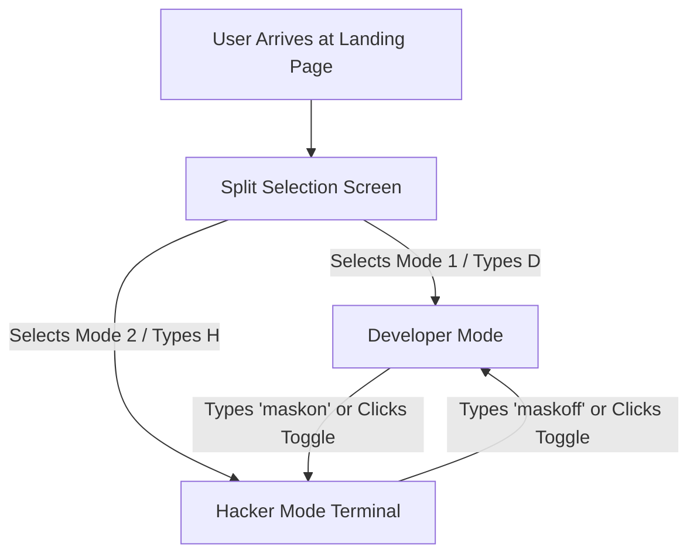

# Product Requirement Document (PRD)
## Project Name: Nishchal Goyal Personal Portfolio Website (v3.3)
**Author**: Antigravity AI  
**Status**: Completed & Deployed  
**Target Audience**: Cybersecurity Recruiters, Software Engineering Leads, Startup Founders

---

## 1. Executive Summary & Vision
The goal of this project is to create an immersive, premium, dual-experience portfolio website for Nishchal Goyal (ECE Final Year, SKIT Jaipur, Batch 2027), a Backend Developer and Offensive Security Learner. 

Instead of a generic scrolling resume website, the portfolio must embody his dual-identity story under the theme of **"Canon Breaker"**:
1. **The Developer (Gwen Stacy / Warm Magazine Theme)**: A high-fidelity, grid-based, editorial magazine layout highlighting REST APIs, PostgreSQL databases, Python backends, and cybersecurity certifications.
2. **The Security Researcher (UNIX Console Theme)**: An authentic, low-level UNIX terminal simulator that processes case-insensitive commands, manages recursive history, supports inline arrow-key cursor editing, and allows color themes.

---

## 2. Product Philosophy & Key Constraints
- **Story-Driven Interaction**: Every interaction (easter eggs, animations, themes) must reinforce the narrative of operating outside conventional bounds (breaking the ECE curriculum "canon").
- **Visual Excellence**: Clean warm yellow color palette (`#FEFAE0`) in Developer Mode, contrasting with customizable monospace hacker colors in Terminal Mode. Zero placeholder assets.
- **Zero Friction**: Hacker Mode must load instantly without slow boot sequences, ensuring immediate utility for recruiters typing commands.
- **No Simple Web-Terminal Styling**: The terminal mode must act like a genuine bash shell rather than styled markdown cards. Everything is processed through command inputs.

---

## 3. High-Level User Journey

---

## 4. Functional Requirements

### 4.1. Split Landing Screen
- **Dual Visual Columns**: Left side represents "THE DEVELOPER" (butter yellow background); right side represents "SECURITY RESEARCHER" (solid black background).
- **Keyboard Navigation**: Pressing `D` instantly initiates the Developer Mode transition. Pressing `H` initiates the Hacker Mode transition.
- **Smooth Expand**: Clicking or selecting a column triggers a 700ms horizontal expansion animation where the chosen side widens to fill 100% of the screen.

### 4.2. Developer Mode (Warm Magazine Layout)
- **Lore Rename**: The traditional "About" section is named "Lore" to fit the comic book dual-identity narrative.
- **Hero Name Layout (Space Grotesk)**: 
  - Uses the **Space Grotesk** geometric bold font (weight 800, non-italic).
  - "Nishchal" is on line 1 and "Goyal" is on line 2 (with golden accent outline stroke `#E9C46A` and glowing text shadow).
  - Uses `white-space: nowrap` and a `max-width: 600px` container to ensure words stay contiguous and don't break at odd zoom levels (from 75% to 200%).
- **Header Logo Navigation**: The top-left `NG.` logo is clickable and scrolls the page smoothly back to the top of the dev portfolio.
- **Favicon Integration**: Replaced the purple lightning SVG favicon with the transparent `hero.png` image.
- **Staggered Overlapping Projects Grid**:
  - Projects (`AegisGuard`, `IntelScope-Pulse`, `WriteBlog`) are laid out with staggered vertical alignments and overlaps using custom negative margins (`margin-top: -6rem`) to create a professional magazine aesthetic.
  - Hovering over cards changes background colors: cybersecurity cards hover to `#FEF5F5` and normal cards to `#FEFAE0`.
- **Double Featured Certifications**:
  - The Google Cybersecurity and Deloitte Cyber Job Simulation certificates are emphasized with a red outline (`cert-card-featured`) and verified red tag badging (`cert-verified-red`) to highlight security competence.
  - Cert card paddings are minimized (`1.25rem 1.5rem` with a `4px` gap) to remove excess empty spacing.
- **Subtle Proximity Alerts (Spider-Sense)**:
  - Custom cursor displays 5 wavy warning arcs radiating from the top half of the cursor ring when approaching specific elements: the interactive spider web SVG and the Honda CB350 pill. All other elements (normal cards, headers, contact links) trigger standard cursor hovers.
- **Honda CB350 Motorcycle Run**:
  - Hovering/clicking the CB350 pill activates an off-screen motorcycle emoji `🏍️` that rides horizontally from **RIGHT to LEFT** across the bottom of the viewport, bobbing vertically, and fading out.
- **Delayed Post-Credits Scene**:
  - Scrolling past the footer and remaining at the absolute bottom for 4 seconds triggers a sequential terminal credit block displaying `"wait"`, `"Canon rejected"`, `"Story still loading"`, and a blinking cursor. Stored in `sessionStorage` to run only once per session.
- **Footer Quote**: The Miles Morales quote is split across two lines: *"Everyone keeps telling me how my story is supposed to go. \n Nah… I’m-a do my own thing."*

### 4.3. Hacker Mode (Low-Level UNIX Terminal)
- **Instant Console Prompt**: Toggle switches render the shell immediately with a blinking block cursor.
- **Pre-Seeded Greeting Output**: Startup renders the block ASCII name `"NISHCHAL"`, a custom Spider Hood character figure on the far right, and subtitle slogans: *"building systems by day / breaking them by night"*.
- **UNIX History Navigation**: Pressing `ArrowUp` or `ArrowDown` navigates sequentially through previously typed commands using a state-tracked index.
- **Inline Caret Navigation**: Tapping `ArrowLeft` or `ArrowRight` shifts the cursor block inside the input string, allowing typing and backspacing inside words. The character under the cursor is inverted.
- **Single-Line Theme Explorer**: The `themes` command lists available themes in a single line (`light  dark  peter  miles  noir  2099  kali`) without descriptions to encourage user discovery.
  - The `peter` theme is re-designed with a high-contrast Spider-Man suit interplay of bright red (`#FF0000`) primary text and bright blue (`#0066FF`) accent borders, glows, highlights, and secondary text.
- **Command Set**:
  - *Standard*: `about`, `whoami`, `skills`/`s`, `projects`/`p`, `project <name>`, `experience`, `certs`, `journey`, `contact`/`c`, `themes`, `theme <name>`.
  - *Narrative*: `canon`, `lore`, `origin`, `reality`, `watcher`, `masks`, `nexus`, `bike`, `hero` (reprints initial splash).
  - *Dynamic*: `coffee` (cyclical status checks).
  - *Hidden*: `miles`, `peter`, `glitch` (brief screen-scrambling visual flicker).
  - *Control*: `clear` (clears log buffers), `maskoff` (sequenced delay back to Dev Mode, running immediately with no terminal print history logs).

---

## 5. Non-Functional Requirements
- **Performance**: High frame rate cursor tracking and lerp coordinates via `requestAnimationFrame` to ensure zero drag.
- **Aesthetics**: High contrast font styling (JetBrains Mono and Playfair Display), seamless background multiply-blending for the PNG illustration, and styled console scanlines.
- **Browser Compatibility**: Fully responsive layout matching breakpoints from small mobile screens (360px) to wide desktops. Custom cursor falls back to native cursor on mobile/touch interfaces.
